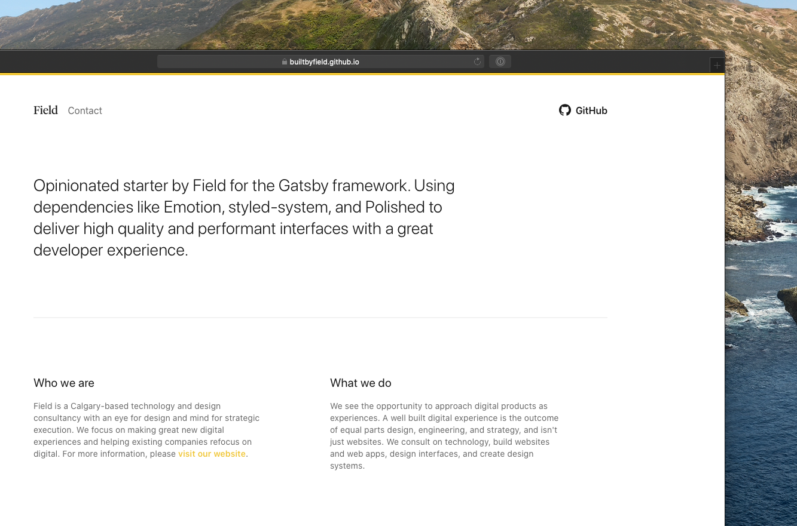

# Table of contents

<!--toc-start-->

- [Table of contents](#table-of-contents)
- [Introduction](#introduction)
- [Getting started](#getting-started)
- [What's inside?](#whats-inside)
- [Styling](#styling)
- [Contributing](#contributing)
- [Common project checklist](#common-project-checklist)
  - [Infrastructure](#infrastructure)
  - [Styling](#styling)
  - [Testing](#testing)
- [About Field Creative Inc.](#about-field-creative-inc)
  - [How we work](#how-we-work)
  - [What we do](#what-we-do)
  - [Contact](#contact)

<!--toc-end-->

# Introduction

A starter built using [GatsbyJS](https://www.gatsbyjs.org/) by [Field Creative Inc](https://builtbyfield.com/). We utilize a CSS-in-JS approach for styling using a combination of [Emotion](https://emotion.sh/) and [styled-system](https://styled-system.com/) (please find more information about this down below).

Our GatsbyJS setup includes a plugin for Layouts which allows us to use the original GatsbyJS API for setting up a common wrapper for usage across every page of the website.

Nearly all components are built from the `Box` component primitive which we inject with nearly all styled-system props. As often as we can, we refer to the `Theme` component for accessing variables such as color, spacing, fonts, and typographic sizes and weights. These things help us to customize and inject our internal design system in a perdictable manner as the project calls for it.

For more information about how this technology stack operates refer to the documentation of the packages we work with to learn more. Additional questions should be sent to [info@builtbyfield.com](mailto:info@builtbyfield.com) with a subject line that includes the name of the repo. For help with the expansion of the website using our internal design system, please also refer to the same email.

# Getting started

1. Install packages with `yarn install`
2. Run `yarn develop` to spin up the website
3. Navigate to `localhost:8000` in your favourite browser to view

# What's inside?

A quick look at the top-level files and directories you'll see in this project.

    .
    ├── node_modules
    ├── src
    ├── static
    ├── .env
    ├── .gitignore
    ├── .prettierignore
    ├── .prettierrc
    ├── gatsby-browser.js
    ├── gatsby-config.js
    ├── gatsby-node.js
    ├── gatsby-ssr.js
    ├── LICENSE
    ├── package.json
    ├── README.md
    └── yarn.lock

1.  **`/node_modules`**: This directory contains all of the modules of code that your project depends on (npm packages) are automatically installed.

2.  **`/src`**: This directory will contain all of the code related to what you will see on the front-end of your site (what you see in the browser) such as your site header or a page template. `src` is a convention for “source code”.

3.  **`/static`**: This directory contains all assets that should not be processed by the build pipeline but directly uploaded the server. They can be referenced by referring to the root of the site. We use this primarily for font files.

4.  **`.env`**: A file to pass secure tokens. You will need to add this manually as this does not get passed in with git. In this case we use it to pass in the Contentful CMS access token.

5.  **`.gitignore`**: This file tells git which files it should not track / not maintain a version history for.

6.  **`.prettierignore`**: This file tells Prettier (see below) which files it should not help format.

7.  **`.prettierrc`**: This is a configuration file for [Prettier](https://prettier.io/). Prettier is a tool to help keep the formatting of your code consistent.

8.  **`gatsby-browser.js`**: This file is where Gatsby expects to find any usage of the [Gatsby browser APIs](https://www.gatsbyjs.org/docs/browser-apis/) (if any). These allow customization/extension of default Gatsby settings affecting the browser.

9.  **`gatsby-config.js`**: This is the main configuration file for a Gatsby site. This is where you can specify information about your site (metadata) like the site title and description, which Gatsby plugins you’d like to include, etc. (Check out the [config docs](https://www.gatsbyjs.org/docs/gatsby-config/) for more detail).

10. **`gatsby-node.js`**: This file is where Gatsby expects to find any usage of the [Gatsby Node APIs](https://www.gatsbyjs.org/docs/node-apis/) (if any). These allow customization/extension of default Gatsby settings affecting pieces of the site build process.

11. **`gatsby-ssr.js`**: This file is where Gatsby expects to find any usage of the [Gatsby server-side rendering APIs](https://www.gatsbyjs.org/docs/ssr-apis/) (if any). These allow customization of default Gatsby settings affecting server-side rendering.

12. **`LICENSE`**: Gatsby is licensed under the MIT license.

13. **`package.json`**: A manifest file for Node.js projects, which includes things like metadata (the project’s name, author, etc). This manifest is how npm/yarn knows which packages to install for your project.

14. **`README.md`**: A text file containing useful reference information about your project.

15. **`yarn.lock`** (See `package.json` above, first). This is an automatically generated file based on the exact versions of your npm dependencies that were installed for your project. **(You won’t change this file directly).**

# Styling

Our method for styling elements in this project uses [Emotion](https://emotion.sh/), a library designed for writing css styles with JavaScript. It provides powerful and predictable style composition in addition to a great developer experience with features such as source maps, labels, and testing utilities. Both string and object styles are supported.

Because Emotion abstracts away most traditional CSS classes, we use HTML `data-*` attributes to label components so that editors can easily identify what elements are what components in the DOM. We do this by assigning components `data-component-id="componentName"` attributes. These are great for element-associated metadata and have [little to no performance overhead](https://developer.mozilla.org/en-US/docs/Learn/HTML/Howto/Use_data_attributes).

To expand upon Emotion, we use [styled-system](https://styled-system.com/) which provides us with "style props for rapid UI development." We're able to assign most of the typically styles we use to a component called `Box` which we can then use as a starting point for new components. This allows us to write shorthand CSS and access our `Theme.js` variables providing consistent spacing, colours, fonts, type styles, and breakpoints. Style prop definitions automatically generate into CSS classes that are assigned to their components.

# Contributing

We try to comment our code in two ways: 1) describe the "why" for potentially confusing areas of code where the rationale is perhaps foggy, 2) to highlight significant sections of content that may appear distinct on the frontend in either their appearance or behaviour. When contributing to this project, please continue this practice so that other developers have the same clarity when working on the project.

# Common project checklist

## Infrastructure

- [ ] Create task list
- [ ] Set up code infrastructure
- [ ] Set up version control
- [ ] Set up hosting
- [ ] Model content management system (CMS)
- [ ] Pass data from CMS to code (have it rendering and ready for styling)

## Styling

- [ ] Receive designs and new assets
- [ ] Flag easy, medium, and challenging style tasks
- [ ] Set up theme files (colors, fonts, spacing, grid, typography, wrapper, etc)
- [ ] Style specific components (buttons, dropdowns, etc)
- [ ] Layout content in alignment with designs
- [ ] Adjust layout to respond to mobile specifications
- [ ] Fine tune styling to make pixel-perfect to designs
- [ ] Introduce interactive motion and animations

## Testing

- [ ] Set up bug tracking and review with design team
- [ ] Browser testing
- [ ] SEO testing
- [ ] Final polish and bug fixing

# About Field Creative Inc.

[Field](https://builtbyfield.com/) is a Calgary-based digital product consultancy with an eye for design and mind for strategic execution. We focus on making great new digital experiences and helping existing companies refocus on digital. We don't just make websites and apps—we help organizations understand complex digital problems and build the tools, systems, and digital services needed to solve them. We believe in content driven development that starts with strategy and ends with implementation, utilizing whatever range of technologies or tools to help accomplish a goal. We typically work in four phases: Architect, Design, Build, and Grow.

## How we work

1. **Architect**: We work with you to find the right combination of technology and plan the execution of your digital product.
2. **Design**: We work from a technical perspective to deliver you user experience and aesthetics tailored for digital experiences.
3. **Build**: We work using industry leading techniques and frameworks to custom build your product specific to your needs.
4. **Grow**: We work to assist and educate you in making the best use of the solutions we build for you so you can independently own and grow your product.

## What we do

1. **Technology consulting**: Start with a plan, not a solution. We believe consulting is the first step to solving a digital problem the correct way.
2. **Digital experiences**: We see the opportunity to approach websites as experiences in order to elevate customer conversion and retention. A well built digital experience is the outcome of equal parts design, engineering, and strategy.
3. **Design systems**: The reason for introducing a design system is not so people can work less—it's so people can work better. A carefully built and well maintained design system can align an organization.
4. **No-code**: Building digital tools and automation doesn't always have to mean a website. No-code can help get your idea off the ground faster.

## Contact

We can be reached at [info@builtbyfield.com](mailto:info@builtbyfield.com) or at [our website](https://builtbyfield.com/).
